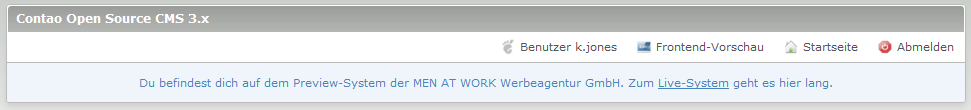

currentInstallation Extension
=============================

Mit der Extension currentInstallation kann man Backendbenutzern mehrsprachige Hinweise im Backend hinterlassen. Zum Beispiel, dass er sich auf einem Previewsystem befindet oder welche spezifische Inserttags er nutzen kann. 

Leave multilingual informations to backend user in the backend with the currentInstallation extension. For example, that they are on a preview system or which specific insert tags they can use. 

